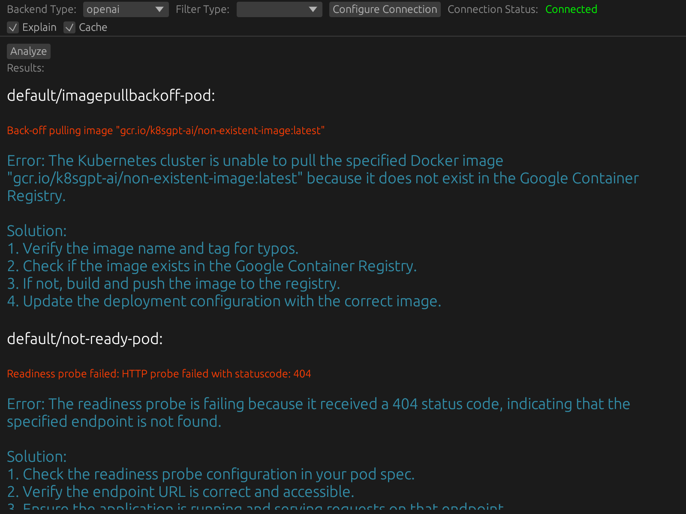

# power_nerd

PowerNerd is a UX for [k8sgpt](https://github.com/k8sgpt-ai/k8sgpt.git)

It allows you to run analysis commands on your Kubernetes cluster and configure K8sGPT from a GUI.

## Usage

- Requires a running K8sGPT serve, either locally or remotely
- Start power_nerd 